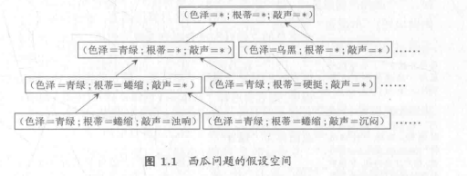

# 第一章 绪论

2022/5/15	雾切凉宫

## 1.2 基本术语

| 中文名                     | 英文名                         | 意义                     |
| -------------------------- | ------------------------------ | ------------------------ |
| 数据集                     | data set                       | 一组记录的集合           |
| 示例/样本/特征向量         | instance/sample/feature vector | 一条记录（对对象的描述） |
| 属性/特征                  | attribute/feature              | 对象的表现或性质         |
| 属性值                     | attribute value                | 属性上的取值             |
| 属性空间/样本空间/输入空间 | attribute space/sample space   | 属性张成的空间           |
| 标记                       | label                          | 示例“结果”的信息         |
| 样例                       | example                        | 拥有标记信息的示例       |
| 分类                       | classification                 | 预测离散值               |
| 回归                       | regression                     | 预测连续值               |
| 聚类                       | clustering                     | 不拥有标记信息的分类     |
| 簇                         | cluster                        | 聚类分成的每一个组       |

举个例子：

| 术语名 | 表达式                                                       |
| ------ | ------------------------------------------------------------ |
| 数据集 |  |
| 示例   |  |
| 属性值 |  |

## 1.3 假设空间

对于达成一个结果所作所有假设组成的空间（非原文，自己归纳的）

