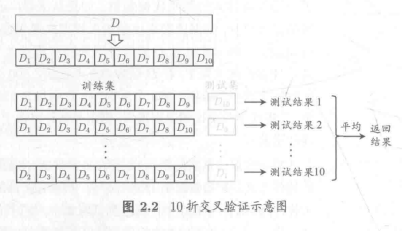
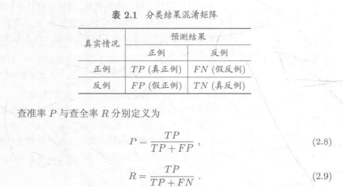
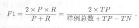
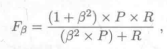

# 第二章 模型评估与选择

2022/5/15 雾切凉宫	至2.3.3节

## 2.1 经验误差与过拟合

| 中文名            | 英文名                         | 意义                 |
| ----------------- | ------------------------------ | -------------------- |
| 训练误差/经验误差 | training error/empirical error | 学习器在训练集的误差 |
| 泛化误差          | generalization error           | 在新样本上的误差     |
| 过拟合            | overfitting                    | 学习能力过于强大     |
| 欠拟合            | underfitting                   | 学习能力低下         |

## 2.2 评估方法

通过实验测试来对学习器的泛化误差进行评估

### 2.2.1 留出法

留出法(hold-out)直接将数据集D划分为两个互斥的集合，其中一个集合作为训练集S,另一个作为测试集T,即D= SUT, S∩T=0.在S上训
练出模型后,用T来评估其测试误差，作为对泛化误差的估计。

### 2.2.2 交叉验证法

“交叉验证法”(cross validation)先将数据集D划分为k个大小相似的互斥子集。每个子集Di都尽可能保持数据分布的一致性，即从D中通过分层采样得到。然后，每次用k-1个子集的并集作为训练集，余下的那个子集作为测试集;这样就可获得k组训练/测试集，从而可进行k次训练和测试，通常把交叉验证法称为“k折交叉验证”(k-fold cross validation)。k最常用的取值是10，此时称为10折交叉验证;其他常用的k值
有5、20等。

### 2.2.3 自助法

“自助法”(bootstrapping)以自助采样法(bootstrap sampling)为基础(Efron and Tibshirani, 1993]. 给定包含m个样本的数据集D,我们对它进行采样产生数据集D:每次随机从D中挑选一个样本，将其拷贝放入D'，然后再将该样本放回初始数据集D中，使得该样本下次采样时仍有可能被采到；这个过程重复执行m次后，我们就得到了包含m个样本的数据集D'，这就是自助采样的结果。

自助法在数据集较小、难以有效划分训练/测试集时很有用。

### 2.2.4 调参与最终模型

大多数学习算法都有些参数(parameter)需要设定，参数配置不同，学得模型的性能往往有显著差别，因此，在进行模型评估与选择时，除了要对适用学习算法进行选择，还需对算法参数进行设定，这就是通常所说的“参数调节”或简称“调参”(parameter tuning).

## 2.3 性能度量

### 2.3.1错误率与精度

错误率是分类错误的样本数占样本总数的比例；

精度则是分类正确的样本数占样本总数的比例。

### 2.3.2查准率、查全率与F1

与错误率、精度等的区别个人感觉类似概率论中的条件概率。

对于二分类问题，可将样例根据其真实类别与学习器预测类别的组合划分为**真正例TP**(true positive)、 **假正例FP**(false positive)、 **真反例TN**(true negative)、**假反例FN**(false negative)四种情形，则显然有TP+ FP+TN+ FN =1样例总数。分类结果的“混淆矩阵”(confusion matrix)如表2.1所示。

**查准率P和查全率R**是一对矛盾的度量。故我们需要**“平衡点”(Break- Even Point, 简称BEP)**，它是“查准率P=查全率R”时的取值。

但平衡点BEP还是过于简化了些，更常用的是**F1度量**:

带偏好的**F1度量**：（**β** >0表示**查全率R对查准率P**的相对重要性）

P.S. β> 1时查全率R有更大影响; β< 1时查准率P有更大影响.

