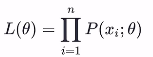
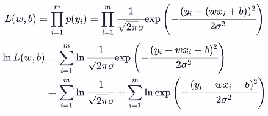

# 第三章 线性模型

2022/5/16 雾切凉宫 至3.2节/视频P3

[TOC]

## 3.1 基本形式

**线性模型**(linear model)试图学得一个通过属性的线性组合来进行预测的函数，即
$$
f(x)=w_1x_1+w_2x_2+……+w_dx_d+b
$$
**向量形式**：
$$
f(x)=w^Tx+b
$$
w和b学得之后，模型就得以确定。

## 3.2 线性回归

数据集D：
$$
D=\{(x_1,y_1),(x_2,y_2),……(x_m,y_m),\}
$$
其中：
$$
x_i=(x_{i1};x_{i2};……;x_{id})
$$

### P2 一元线性回归

*p2指的是datawhale吃瓜教程视频p2*

#### P2.1 最小二乘法

**均方误差**（损失函数）：
$$
E(w,b)=\sum_{i=1}^m(y_i-f(x_i))^2=\sum_{i=1}^m(y_i-wx_i-b)^2
$$
**均方误差**损失函数与“欧式距离”**相同**，基于均方误差求解模型称为**最小二乘法**
$$
(w,b)=argmin_{(w,b)}\sum_{i=1}^m(y_i-wx_i-b)^2
$$
P.S. argmin指后面式子取最小值时（w，b）的值！

#### P2.2 极大似然估计

极大似然原理：使得观测样本**出现概率最大**的分布就是**待求分布**，也即使得联合概率(似然函数) L(θ)取到最大值的θ*即为θ的估计值。
$$
x_1,x_2,x_3……,x_n是n个独立同分布的样本，x已知θ未知
$$
他们的联合概率为（**似然函数**）：

**说人话：让L(θ)最大的θ值即为待求分布参数θ的值**

P.S：分布参数：如正态分布N(μ，σ^2)。
$$
一般的，使用lnL(θ)代替L(θ)以简化连乘项
$$

##### 误差ε

线性回归模型为：
$$
y=wx+b+ε
$$
ε为不受控制的随机误差，通常假设其服从正态分布ε~N(0，σ^2)

故ε的概率分布函数为：
$$
p(ε)=\frac{1}{\sqrt{2π}σ}e^{-\frac{ε^2}{2σ^2}}
$$
进而可知：
$$
p(y)=\frac{1}{\sqrt{2π}σ}e^{-\frac{(y-(wx+b))^2}{2σ^2}}
$$

##### 极大似然估计解法

上式可看做y~N(wx+b，σ^2)，写出似然函数L(w,b):

根据最大似然理论，求似然函数L(w,b)取最大值时(w,b)的取值。

由于上式中第一项为常数，所以问题简化为求第二项的最大值：
$$
(w^*,b^*)=argmax_{(w,b)}lnL(w,b)=argmin_{(w,b)}\sum_{i=1}^m(y_i-wx_i-b)^2
$$
可见所得结果与之前使用[最小二乘法](#jump)所得结果一致

#### P2.3 求解w和b

由之前最小二乘法与极大似然估计法都得出同一个结果：
$$
(w^*,b^*)=argmin_{(w,b)}\sum_{i=1}^m(y_i-wx_i-b)^2
$$

$$
E(w,b)=\sum_{i=1}^m(y_i-wx_i-b)^2
$$

对于E(w,b)为凸函数的证明这里不再赘述。

分别对w和b求导：
$$
\frac{\partial{E(w,b)}}{\partial{w}}=2(w\sum_{i=1}^mx_i^2-\sum_{i=1}^m(y_i-b)x_i)
$$

$$
\frac{\partial{E(w,b)}}{\partial{b}}=2(mb-\sum_{i=1}^m(y_i-wx_i))
$$

由于▽E(w,b)=0时函数取最小值，代入上述二式得：
$$
w=\frac{\displaystyle\sum_{i=1}^my_i(x_i-\overline{x})}{\displaystyle\sum_{i=1}^mx_i^2-\frac{1}{m}(\sum_{i=1}^mx_i)^2}
$$

$$
b=\frac{1}{m}\sum_{i=1}^m(y_i-wx_i)
$$

#### P2.4 机器学习三要素

1. 模型:根据具体问题，确定假设空间
2. 策略:根据评价标准，确定选取最优模型的策略(通常会产出一个“损失函数”
3. 算法:求解损失函数，确定最优模型

### P3 多元线性回归

#### P3.1 由最小二乘法导出w

模型为：
$$
f(x_i)=\begin{bmatrix}w_1 & w_2…w_d & b\end{bmatrix}\begin{bmatrix} x_{i1} \\
				x_{i2} \\
				\vdots \\
				x_{id} \\
				1 \\
				\end{bmatrix}
$$
简写为：
$$
f(\hat{x_i})=\hat{w^T}\hat{x_i}
$$
由**最小二乘法**可得**损失函数E(w)**：
$$
E(\hat{w})=\sum_{i=1}^m(y_i-f(\hat{x_i}))^2=\sum_{i=1}^m(y_i-\hat{w^T}\hat{x_i})^2
$$
向量化**损失函数E(w)**：

举个例子：
$$
a^2+b^2=[a,b]\begin{bmatrix}a\\b\end{bmatrix}
$$
所以**损失函数E(w)**可化简为：
$$
E(\hat{w})=\begin{bmatrix}y_1-\hat{w}^T\hat{x_1} & y_2-\hat{w}^T\hat{x_2}…y_m-\hat{w}^T\hat{x_m}\end{bmatrix}
\begin{bmatrix}
y_1-\hat{w}^T\hat{x_1} \\
y_2-\hat{w}^T\hat{x_2} \\
\vdots				   \\
y_m-\hat{w}^T\hat{x_m}
\end{bmatrix}
$$
又对上式中最后的**列向量**可以化简：
$$
\begin{bmatrix}
y_1-\hat{w}^T\hat{x_1} \\
y_2-\hat{w}^T\hat{x_2} \\
\vdots				   \\
y_m-\hat{w}^T\hat{x_m}
\end{bmatrix}=
\begin{bmatrix}
y_1 \\
y_2 \\
\vdots				   \\
y_m
\end{bmatrix}
-
\begin{bmatrix}
\hat{w}^T\hat{x_1} \\
\hat{w}^T\hat{x_2} \\
\vdots				   \\
\hat{w}^T\hat{x_m}
\end{bmatrix}
=y-X\hat{w}
$$
最终**损失函数E(w)**为：
$$
E(\hat{w})=(y-X\hat{w})^T(y-X\hat{w})
$$
**求w**的问题转化为：
$$
\hat{w}=argmin_{\hat{w}}E(\hat{w})=argmin_{\hat{w}}(y-X\hat{w})^T(y-X\hat{w})
$$
同样对于E(w)为凸函数的证明这里不再赘述。

**对w求导**得：
$$
\frac{\partial{E(\hat{w})}}{\partial{\hat{w}}}=2X^T(X\hat{w}-y)
$$

由于▽E(w)=0时函数取最小值，代入上式得：
$$
\hat{w}^*=(X^TX)^{-1}X^Ty
$$

## 3.3 对数几率回归

### p4 对数几率回归

#### p4.1 算法原理

