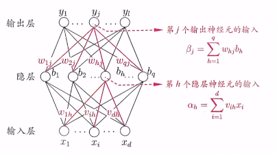

# 第5章 神经网络

2022/5/28 雾切凉宫 至5.3节/视频P7

[TOC]

## 5.1 神经元模型

### p7 神经网络

#### p7.1 M-P神经元

M-P神经元：接收**n个输入**(通常是来自其他神经元)，并给各个输入赋予**权重**计算加权和，然后和自身特有的**阈值θ**进行比较(作减法)，最后经过**激活函数f**(模拟“抑制"和“激活”)处理得到输出(通常是给下一个神经元)
$$
y=f(\sum_{i=1}^nw_ix_i-θ)=f(w^Tx+b)
$$
常见激活函数f：

- sgn函数
- sigmoid函数

## 5.2 感知机与多层网络

#### p7.2 感知机

##### 感知机模型

激活函数为sgn (阶跃函数)的神经元
$$
y=sgn(w^Tx-θ)
$$
x为特征向量，（w,θ）为神经元参数（权重，阈值）

##### 感知机学习策略

随机初始化w, b,将全体训练样本代入模型找出误分类样本，假设此时误分类样本集合为M∈T,对任意一个**误分类样本**来说，以下公式恒成立：
$$
(\hat{y}-y)(w^Tx-θ)>=0
$$
所以，给定数据集T，其**损失函数**可以定义为：
$$
L(w,θ)=\sum_{x∈M}(\hat{y}-y)(w^Tx-θ)
$$
显然,，此损失函数是非负的。如果没有误分类点，损失函数值是0。而且，误分类点越少，误分类点离超平面越近,损失函数值就越小。

具体地，给定数据集
$$
T = \{(x_1, y_1), (x_2,y_2),...,(x_n,y_n)\}
$$

$$
其中x_i∈R,y_i∈\{0,1\}，求参数w,θ,使其为极小化损失函数的解:
$$

$$
min L(w,θ)= {min}_{w,θ}\sum_{x_i∈M}(\hat{y_i}- y_i)(w^Tx_i-θ)
$$

其中M为误分类样本集合。若将阈值θ看作一个固定输入为-1的“哑节点”，即：
$$
-θ=-1*W_{n+1}=x_{n+1}*w_{n+1}
$$
根据该式，可将要求解的极小化问题进一步**简化**为：
$$
min_{w}L(w)=min_w\sum_{x_i∈M}(\hat{y_i}-y_i)w^Tx_i
$$

##### 感知机学习算法

当误分类样本集合M固定时、那么可以求得损失函数L(w)的梯度为：
$$
▽_wL(w)=\sum_{(x_i∈M)}(\hat{y_i}-y_i)x_i
$$
感知机的学习算法具体采用的是随机梯度下降法，也就是极小化过程中不是一次使M中所有误分类点的梯度下降，而是一次随机选取一个误分类点使其梯度下降。所以权重**w的更新公式**为：（η为学习率）
$$
w=w+△w
$$

$$
△w=-η(\hat{y_i}-y_i)x_i=η(y_i-\hat{y_i})x_i
$$

#### p7.3 神经网络

##### 多层前馈网络

多层前馈网络:每层神经元与下一层神经完全互连，神经元之间不存在同层连接，也不存在跨层连接。 (隐层阈值γn， 输出层阈值θj)

一般地，按照需要完成的任务来选择损失函数，比如

- 一个多输出**回归任务**：损失函数一般采用**均方误差**。

- 一个**分类任务**：损失函数使用**交叉熵**。

  

##### 误差逆传播算法（BP）

基于随机梯度（损失函数的梯度）下降的参数更新算法：

$$
w=w+△w
$$

$$
△w=-η▽_wE
$$

#### 

其中只需推导出▽wE这个损失函数E关于参数w的一阶偏导数(梯度)即可(链式求导)。值得一提的是，由于NN(x )通常是极其复杂的非凸函数，不具备像凸函数这种良好的数学性质，因此随机梯度下降**不能保证一定能走到全局最小值点**，更多情况下走的都是局部极小值点。