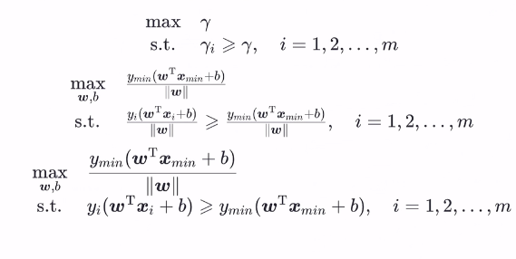

# 第6章 支持向量机

2022/6/2 雾切凉宫 至6.5节/视频P9

[TOC]

## 6.1 间隔与支持向量

### p8 支持向量机

##### 超平面

n维空间的超平面 :
$$
w^Tx +b= 0,其中w,x∈R^n
$$
●超平面方程不唯一
●法向量w和位移项b确定一个唯一超平面
●法向量w垂直于超平面(缩放w, b时，若缩放倍数为负数会改变法向量方向)
●法向量w指向的那一半空间为正空间，另一半为负空间
●任意点x到超平面的**距离公式**为
$$
r=\frac{|w^Tx+b|}{||w||}\\\\

[证明] :对于任意一点x_0 = (x_1^0, x^0_2....,x^0_n)^T,设其在超平面w^Tx + b= 0上的投影点为x1 = (x_1^1,x^1_2...,x_n^1)^T\\
则w^Tx_1+b=0,且向量\overrightarrow{x_1x_0}与法向量w平行，因此\\
|w*\overrightarrow{x_1x_0}|= | ||w||*cosπ*|\overrightarrow{x_1x_0}|\\
= ||w||*r\\
w*\overrightarrow{x_1x_0}= w_1(x_1^0-x_1^1) +w_2(x_2^0-x_2^1)+... + w_n(x_n^0-x_n^1)\\
=w^Tx_0-w^Tx_1=w^Tx_0+b\\
由w^Tx_0+b=||w||*r得\\
r=\frac{|w^Tx+b|}{||w||}\\
$$

##### 几何间隔

$$
对于给定的数据集X和超平面w^Tx +b= 0,定义数据集X中的任意一个样本点
(x_i,y_i),y_i∈{-1,1},i= 1,2.... m关于超平面的几何间隔为\\
γ_i =\frac{yi(w^Tx_i + b)}{||w||}
$$

正确分类时：γi > 0，几何间隔此时也等价于点到超平面的距离
没有正确分类时： γi < 0
对于给定的数据集X和超平面w^Tx +b= 0，定义数据集X关于**超平面的几何间隔**为:数据集X中所有样本点的几何间隔最小值
$$
γ=\min_{i=1,2,...,m}γ_i
$$

##### 支持向量机

模型:给定线性可分数据集X，支持向量机模型希望求得数据集X关于超平面的几何间隔y达到最大的那个超平面，然后套上一个sign函数实现分类功能
$$
y= sign(w^Tx+b)
$$
所以其本质和感知机一样，仍然是在求一个超平面。那么几何间隔最大的超平面就一定是我们前面所说的那个“距离正负样本都最远的超平面"吗?
答:是的，原因有以下两点:
●当超平面没有正确划分正负样本时：几何间隔最小的为误分类点，因此γ < 0
●当超平面正确划分超平面时: γ≥0，且越靠近中央γ越大

策略:给定线性可分数据集X,设X中几何间隔最小的样本为(xmin, Ymin)，那么支持向量机找超平面的过程可以转化为以下带约束条件的优化问题：

此优化问题为含不等式约束的优化问题，且为凸优化问题，因此可以直接用很多专门求解凸优化问题的方法求解该问题。在这里，支持向量机通常采用拉格朗日对偶来求解，具体原因待求解完后解释，下面先给出**拉格朗日对偶**相关知识。

## 6.2 对偶问题

##### 凸优化问题/拉格朗日对偶

对于一般地**约束优化问题**:
$$
min\quad f(x)\\
s.t.\quad g_i(x)≤0 \quad i= 1,2...,m \\
h_j(x)=0 \quad j= 1,2...,n
$$
若目标函数f(x )是凸函数，约束集合是凸集，则称上述优化问题为凸优化问题，特别地，g;(x)是凸函数， hi(x)是线性函数时，约束集合为凸集，该优化问题为凸优化问题。显然，支持向量机的目标函数1/2||w||2是关于w的凸函数，对于上面的约束优化问题也是关于w的凸函数，因此支持向量机是一个凸优化问题。

对于上述优化问题有**拉格朗日函数**：
$$
L(x,μ,λ)=f(x)+\sum^m_{i=1}μ_ig_i(x)+\sum^n_{j=1}λ_ih_i(x)\\
其中μ=(μ_1,μ_2,...μ_m)^T,λ=(λ_1,λ_2,...,λ_n)^T为拉格朗日乘子
$$
对于上述优化问题有**拉格朗日对偶函数**：

**拉格朗日对偶函数**为**拉格朗日函数**关于x的下确界
$$
Γ(μ,λ)=\inf_{x∈D}L(x,μ,λ)=\inf_{x∈D}(f(x)+\sum^m_{i=1}μ_ig_i(x)+\sum^n_{j=1}λ_ih_i(x))
$$

- 对偶函数恒为**凹函数**
- μ≥0是，对偶函数Γ(μ,λ)构成上述最优化问题最优值的下界。

##### 解算支持向量机

主问题：
$$
\min_{w,b}\quad \frac{1}{2}||w||^2 \\
s.t.\quad 1-y_i(w^Tx_i+b)≤0,\quad i=1,2,...,m
$$
拉格朗日函数：
$$
L(w,b,α)=\frac{1}{2}||w||^2+\sum_{i=1}^ma_i(1-y_i(w^Tx_i+b))\\
=\frac{1}{2}||w||^2+\sum_{i=1}^ma_i-\sum_{i=1}^mα_iy_iw^Tx_i-b\sum_{i=1}^mα_iy_i \\
令\hat{w}=(w;b)。显然上式是关于\hat{w}的凸函数，直接求一阶导令其等于0，然后带回即可得到最小值，也即拉格朗日对偶函数。
$$

## 6.4 软间隔与正则化

### p9 软间隔与支持向量回归

#### p9.1 软间隔

从数学角度来说，软间隔就是允许部分样本(但要尽可能少)不满足下式中的**约束条件**：
$$
\min_{w,b}\quad \frac{1}{2}||w||^2 \\
s.t.\quad y_i(w^Tx_i+b)≥1,\quad i=1,2,...,m
$$
因此，可以将必须严格执行的约束条件转化为具有一定灵活性的“损失"，合格的**损失函数**要求如下:
●当满足约束条件时，损失为0
●当不满足约束条件时，损失不为0，
●(可选)当不满足约束条件时，损失与其违反约束条件的程度成正比
只有满足以上要求，才能保证在最小化(min) 损失的过程中，保证不满足约束条件的样本尽可能的少。
$$
\min_{w,b}\frac{1}{2}||w||^2+C\sum_{i=1}^mι_{0/1}(y_i(w^Tx_i+b)-1)\\
其中，ι_{0/1}是0/1损失函数\\
$$
C > 0是一个常数，用来调节损失的权重，显然当C→+∞时，会迫使所有样本的损失为0，进而退化为严格执行的约束条件，退化为硬间隔，因此,本式子可以看作**支持向量机的一般化形式**。

由于0/1损失函数非凸、非连续，数学性质不好，使得上式不易求解，因此常用一些数学性质较好的“替代损失函数"来代替0/1损失函数，软间隔支持向量机通常采用的是**hinge (合页)损失**来代替0/1损失函数。
$$
hinge损失：hinge(z)=max(0,1-z)
$$
替换进上式可得：
$$
\min_{w,b}\frac{1}{2}||w||^2+C\sum_{i=1}^mmax(0,1-y_i(w^Tx_i+b))
$$
引入**松弛变量ξi**，上述优化问题便和下述问题等价：
$$
令ξ_i=max(0,1-y_i(w^Tx_i+b))\\
\min_{w,b}\frac{1}{2}||w||^2+C\sum_{i=1}^mξ_i \\
s.t. \quad y_i(w^T+b)≥1-ξ_i \\
ξ_i≥0,i=1,2,...,m
$$

## 6.5支持向量回归

#### p9.1 支持向量回归

相比于线性回归用一条线来拟合训练样本，支持向量回归(SVR) 而是采用一一个以f(x)= w^Tx + b为中心，宽度为2e的间隔带， 来拟合训练样本。落在带子上的样本不计算损失(类比线性回归在线上的点预测误差为0)，不在带子上的则以偏离带子的距离作为损失(类比线性回归的均方误差)， 然后以最小化损失的方式迫使间隔带从样本最密集的地方(中心地带)穿过，进而达到拟合训练样本的目的。

因此SVR的优化问题可以写为：
$$
\min_{w,b}\frac{1}{2}||w||^2+C\sum_{i=1}^ml_ε(f(x_i)-y_i)
$$
其中lε(z)为“ε不敏感损失函数”(类比均方误差损失)
$$
l_ε(z)=0,\quad if |z|≤ε;\quad |z|-ε,\quad if|z|>ε\\
\frac{1}{2}||w||^2为L2正则项，此处引入正则项除了起正则化本身的作用外，也是为了和(软间隔)支持向量机的优化目标保持形式上的一致\\(在这里不用均方误差也是此目的)，
这样就可以导出对偶问题引入核函数，C为调节损失权重的常数。
$$
SVR的优化问题可以改写为：
$$
\min_{w,b，ξ_i}\frac{1}{2}||w||^2+C\sum_{i=1}^mξ_i \\
s.t. \quad -ε-ξ_i≤f(x_i)-y_i≤ε+ξ_i \\
ξ_i≥0,i=1,2,...,m
$$
如果考虑两边采用不同的松弛程度：
$$
\min_{w,b,ξ_i,\hat{ξ_i}}\frac{1}{2}||w||^2+C\sum_{i=1}^m(ξ_i+\hat{ξ_i}) \\
s.t. \quad -ε-\hatξ_i≤f(x_i)-y_i≤ε+\hatξ_i \\
ξ_i≥0,\hatξ_i≥0,i=1,2,...,m
$$
